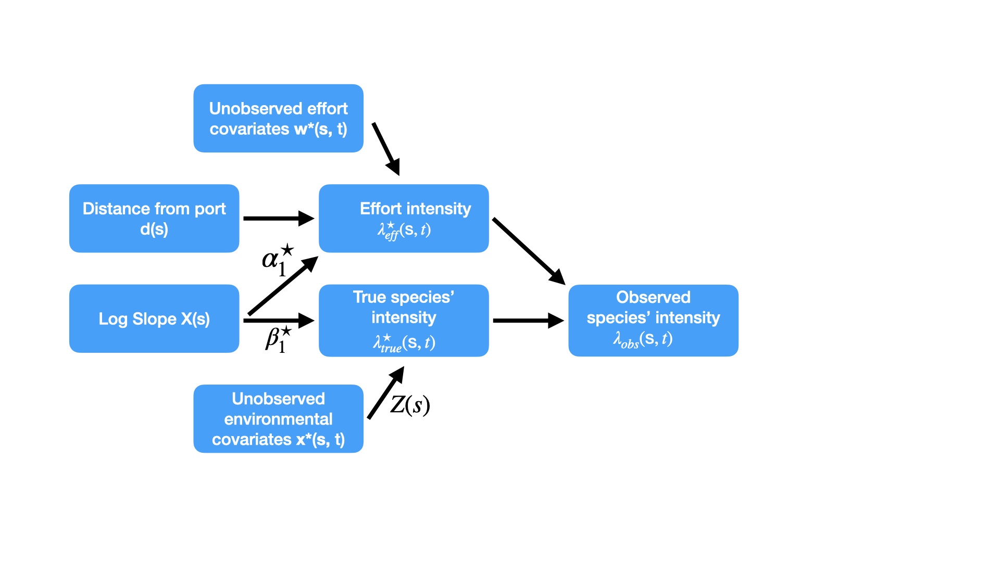
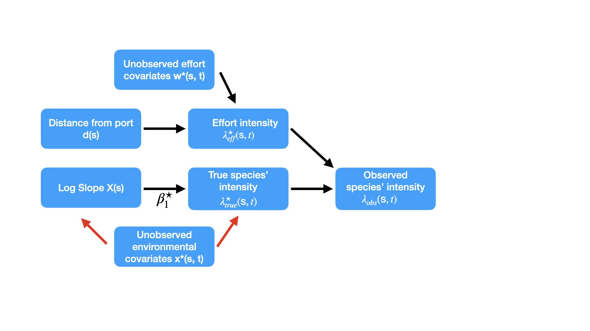

<script src="js/hideOutput.js"></script>

```{r setup, include=FALSE}
knitr::opts_chunk$set(echo = TRUE)
```

## Introduction

In this final tutorial, we will learn how to jointly model presence-only opportunistic sightings with survey data within the `inlabru` package. We will demonstrate how to fit the models use them to predict both the spatial whale intensity and the total number of groups. Finally, we will compare the models' predictive performances on the heldout test data.

### Load packages

```{r warning=FALSE, message=FALSE, error=FALSE}
library(rgeos)
library(rgdal)
library(sp)
library(maptools)
library(spatstat)
library(spdep)
library(INLA)
library(inlabru)
library(readxl)
library(lubridate)
library(ggmap)
library(raster)
```

```{r, echo=F}
library(knitr)
```


### File set up

Use `getwd()` to verify that you are inside the folder titled: 'DFO_SDM_Workshop_2020'. If not, change this by navigating to the correct folder in the bottom right panel (folder view), opening it, and then clicking "Set as Working Directory" under the tab 'More'.

*Fitting these joint models can take a while. For the purposes of this workshop, we have made all the pre-fitted model files available for use via the `readRDS` function. Please ignore any messages regarding inlabru object version 2.2.5.*

Now we can load in the precompiled data, workshop 2 models, and functions.
```{r, message=F, warning=F}
load('./Data/Modelling_Data2_New.RData')
fit <- readRDS('./Model_Files/fit.rds')
fit2 <- readRDS('./Model_Files/fit2.rds')
```

Next, let's ask inlabru to print the convergence information and to perform a fast empirical Bayes analysis.

```{r}
bru_options_set(
  bru_verbose = TRUE,
  verbose = FALSE,
  control.inla=list(int.strategy='eb'),
  num.threads=2
)
```


Finally, let's turn off (as many) warnings associated with coordinate reference systems. 
```{r}
rgdal::set_rgdal_show_exportToProj4_warnings(FALSE)
rgdal::set_thin_PROJ6_warnings(TRUE)
options("rgdal_show_exportToProj4_warnings"="none")
```

## Incorporating the presence-only whale-watch sightings into our models

### Accounting for the unmeasured whale-watch effort

We have little knowledge on the activities of the whale-watching vessels and no GPS data is available. Thus, unlike the survey data, we do not have reliable effort data.

Throughout this tutorial we will assume that the true effort intensities from the two whale-watching companies, $\lambda^\star_{eff}$, is described by a half-normal function of the distance from the two ports. In particular, we will model port $i$'s effort as: $$\textrm{log} \lambda_{i,eff} = \textrm{log} \lambda_{i} - \frac{-d^2}{2\sigma^2_{i}} \\  = \alpha_{i,0} + \alpha_{i,1} d^2.$$

The simplest way to incorporate this into our model, is to define squared distance variables for each port and let the model estimate both $\alpha_{i,0}$ and $\alpha_{i,1}$. Doing this allows `inlabru` to estimate these as linear effects (without requiring the use of Taylor linearisation). Note that we already created these covariates in the first workshop (`Dist_Quoddy_sq`, `Dist_Brier_sq`). 

It should be apparent that we are making a very simplistic assumption on the whale watch effort; it is unlikely that the whale watch vessels truly spread out uniformly in all directions. In future work, more sophisticated estimates of effort should be considered. In fact, at the end of this workshop, we will present some evidence that suggests the half-normal assumption of whale watch effort is inadequate. 

To formulate our estimates of whale watch effort, two important pieces of knowledge are available to us:

* number of daily whale-watch trips that operate from each port

* average trip length from each port

These can be found from the websites of the two whale-watch operators. These two pieces of information can help us to sensibly constrain the model, hopefully giving us more realistic predictions and inference. We will compare the effects of including and excluding this additional information.

Before creating the components and formulae, we should investigate reasonable values for `Dist_Quoddy_sq`, `Dist_Brier_sq`. Let's plot for a couple of values.

```{r}

Brier_hn <- Dist_Brier_sq
Brier_hn$Dist_Brier_sq <- exp(-50*Brier_hn$Dist_Brier_sq)
ggplot() + gg(Brier_hn) + gg(Sightings_Brier_nodup,color='green') + gg(Domain) + ggtitle('alpha_1 = -50')

Brier_hn <- Dist_Brier_sq
Brier_hn$Dist_Brier_sq <- exp(-150*Brier_hn$Dist_Brier_sq)
ggplot() + gg(Brier_hn) + gg(Sightings_Brier_nodup,color='green') + gg(Domain) + ggtitle('alpha_1 = -150')

Brier_hn <- Dist_Brier_sq
Brier_hn$Dist_Brier_sq <- exp(-450*Brier_hn$Dist_Brier_sq)
ggplot() + gg(Brier_hn) + gg(Sightings_Brier_nodup,color='green') + gg(Domain) + ggtitle('alpha_1 = -450')

```

Looking at the plots, we see that a value between -150 and -450 could be reasonable for both `Dist_Quoddy_sq` and `Dist_Brier_sq`. 

### Define and fit the model

For our first model, we will ignore all available information provided about the daily activities of the whale-watch vessels. Instead, we will 'let the data speak for themselves' and inform the most suitable effort surfaces $\lambda_{i,eff}$. We will use the data to inform both the shapes and relative magnitudes ($\alpha_{i,1}$ and $\alpha_{i,0}$) of $\lambda_{i,eff}$ from each port.

Furthermore, based on the causal DAG discussions given in the third lecture, we decide initially to **not** include the spatial field in the models for the whale watch data. Thus, we will model the whale watch encounters with an inhomogeneous Poisson process model, while the survey data will be modelled with a log-Gaussian Cox process model. Only the estimated log slope parameter will be shared across the two models. Details about why we do this are given at the end of this document [(click here)](#Addinfo).

We can now define our components and formulae. Unlike before, we need to define a single components object that contains **all** the required components for both the whale watch **and** survey sightings. 

```{r 'cmp_WW_combined1', cache=TRUE}
cmp_WW_Combined1 <- ~ 
  mySpatial(main = coordinates, model = matern_land) + 
  Dist_Quoddy_sq(main=Dist_Quoddy_sq, model="linear") + # half normal shape
  Dist_Brier_sq(main=Dist_Brier_sq, model="linear") + # half normal shape
  Diff_WW_Q_B(1) + # contrast Brier vs Quoddy
  Intercept_WW_Q(1) + # Intercept for Quoddy
  Intercept(1) +
  lsig(1) +
  log_Slope(main = log_Slope, model='linear')
```

There are a lot of new additions to the components. First, we see the addition of `Dist_Quoddy_sq` and `Dist_Brier_sq`. These define linear covariates on the respective SpatialPixelsDataFrame objects (i.e. they define the half-normal functions) and hence describe the shape and range of the effort surfaces. These were defined as $\alpha_{i,1}$ earlier. 

Next, we include the scalar parameters `Intercept_WW_Q` and `Diff_WW_Q_B`. These will define the intercept for the Quoddy whale-watch port and a term related to the relative log intensity of the Brier whale-watch port compared with Quoddy. In our earlier notation, these two parameters were defined as $\alpha_{Quoddy, 0}$ and $\alpha_{Brier, 0}-\alpha_{Quoddy, 0}$. We will see why we chose to define the second parameter as a contrast later. Finally, we have also chosen to include log slope.

As an aside, if we wanted to include a copy of the spatial field `mySpatial` across the two whale watch datasets we would need to add two additional components. We demonstrate this below, with the two additional components `mySpatial_Brier` and `mySpatial_Quoddy`. Note that these are arbitrary names and could be changed. These components would define copies of the original spatial field `mySpatial`. To tell `inlabru` that we want to copy the original model, we would use the argument `copy = mySpatial`. The argument `fixed = T` would tell `inlabru` that we did not want to scale the field by an estimated scalar parameter. Mathematically, it would say that we want to add $Z(s)$ to each linear predictor, not $\beta_{i,Z}Z(s)$, with $\beta_{i,Z}$ a unique scalar parameter estimated separately for each port $i$.

```{r 'cmp_WW_combined1_2', cache=TRUE, eval=F}
cmp_WW_example <- ~ 
  'previous stuff'... +
  mySpatial(main = coordinates, model = matern_land) + 
  mySpatial_Brier(main = coordinates, copy = 'mySpatial', fixed = T) + # first copy of mySpatial
  mySpatial_Quoddy(main = coordinates, copy = 'mySpatial', fixed = T) # second copy of mySpatial
  
```


Let's continue with our IPP model. We now define the two additional formulae for the whale watch intensities.

```{r 'formulae_combined1', cache=TRUE}
formula_WW_B1 = coordinates ~ 
  Dist_Brier_sq + 
  Intercept_WW_Q + # Notice that we include both the intercept AND contrast term
  Diff_WW_Q_B +
  log_Slope 

formula_WW_Q1 = coordinates ~ 
  Dist_Quoddy_sq + 
  Intercept_WW_Q + # Notice that we only include the intercept term
  log_Slope 
```

These two formulae define the following models: $$\textrm{log} \lambda_{i,obs}(s) = \textrm{log } \lambda_{i,eff}(s)\textrm{log} \lambda_{true}(s) \\ 
\textrm{log } \lambda_{i,eff}(s) = \alpha_{i,0} + \alpha_{i,1}d(s)^2 \\
\textrm{log } \lambda_{true}(s) = \beta X(s).$$

For $i =$ Brier, $\alpha_{i,0}$ is split into two terms: the Quoddy intercept and the difference/contrast term. We do not need to update the formula defined in the previous workshop for the survey data. In case you forgot, here it is:

```{r, cache=T}
formula_2
```

Now, we use the `like`/`bru` approach to combine all three likelihood objects (from the survey and two ports)! We must define the three likelihood objects using the joint set of components defined above.

```{r 'likeWW1', warning=FALSE, cache=TRUE}
# from the survey model earlier
fit2_like = like(data = Sightings_survey,
            samplers = Effort_survey,
            domain = list(
              coordinates = mesh_land,
              distance = INLA::inla.mesh.1d(seq(0, 2, length.out = 30))),
            formula = formula_2,
            family = 'cp')

fit_WW_B1 = like(data = Sightings_Brier_nodup,
                 samplers = Domain,
           domain = list(
             coordinates = mesh_land),
           formula = formula_WW_B1,
           family = 'cp')

fit_WW_Q1 = like(data = Sightings_Quoddy_nodup,
                 samplers = Domain,
                 domain = list(
                   coordinates = mesh_land),
                 formula = formula_WW_Q1,
                 family = 'cp')
```

Notice the polygonal `samplers` used in defining the likelihoods for the whale-watch data. This is because we are assuming that the whale-watch vessels can only travel on water (defined by `Domain`). 

We can now fit the model using `bru`. It can be very slow to fit (~5-10 minutes), so we suggest you load the pre-compiled file yourself using the code below:

```{r 'bruWW1', warning=FALSE, cache=TRUE, message=F}
# Slow to fit, so we load a pre-compiled file instead

#fit_combined1 <- bru(fit2_like, fit_WW_B1, fit_WW_Q1, components = cmp_WW_Combined1, options = list(bru_max_iter=17))
fit_combined1 <- readRDS('./Model_Files/fit_combined1_new.rds')
```


Let's look at the results.

```{r 'bruResultsWW1', warning=FALSE, cache=TRUE, message=F}
fit_combined1$dic$dic #DIC is 2003 - new benchmark can't compare with previous models
summary(fit_combined1) # WAIC has not converged - perhaps model is unstable?
```

The output from `summary` shows some interesting findings! 

We detect a large negative effect of the scaled squared distance from port (`Dist_Quoddy_sq` and `Dist_Brier_sq`). The values both lie between 250 and -450 which seems reasonable considering our earlier plots. 

Most interestingly, we detect a large and highly 'significant' effect of log slope on the whale intensity. The claim of 'significance' comes from the fact that the 95% credible intervals lie far from 0. This conclusion opposes the model we fit to the survey data! Remember - we failed to detect any effect of log slope in the previous workshop from the survey data alone! 

By adding more data, we can expect to gain power to detect species-environmental trends. However, estimated trends from this joint model framework should be treated with caution. The causal DAG tells us that the estimates of these trends could become confounded if a path of association exists between the log slope and the true whale watch effort intensity. For example, suppose the whales do in fact spend more time in regions of high slope. Suppose also that whale watch companies learn this and preferentially situate their vessels in regions of higher slope with the intention of encountering more whales! Here, we would have a path from log depth through to the true effort. This would lead to us over-estimating the effect of log slope on the true whale intensity $\lambda_{true}$! 

Why? Because there would be an effect of log slope on the true effort (say $\alpha_1^\star$) and an effect of log slope on the true intensity ($\beta^\star_1$). By assuming that log slope effects only the true intensity, our model would estimate $\alpha_1^\star + \beta^\star_1$ instead of the desired $\beta^\star_1$! The addition comes from the fact that $exp(\alpha_1^\star X(s))exp(\beta^\star_1 X(s)) = exp((\alpha_1^\star + \beta^\star_1) X(s))$. Note that the 95% credible intervals for the effect of log_Slope from the previous survey-only model and this joint model do not overlap. As we discussed in lecture 3, this should make us suspicious. Either: i) we have detected a large, positive $\alpha_1^\star$ value (as discussed above), ii) we poorly estimated $\beta^\star_1$ using the survey data in the previous workshop, or iii) the estimates of $\beta^\star_1$ using the whale watch data without the Gaussian random field included are being strongly confounded by unmeasured environmental covariates $\textbf{x}^\star(\textbf{s},t)$ whose effects were previously being captured by the random field used in the survey-only model. We display the problematic scenarios i) and iii) with DAGs below. For i), it is the two causal arrows leaving log slope that cause the problem. For iii), it is the two red arrows that cause the confounding.  

```{r, echo=F}

```

```{r, echo=F}

```

Importantly then, depending on which of the above three scenarios holds, including log slope could either improve or harm our spatial predictions of the whale intensity! This is why we should attempt to model/emulate the true effort from the opportunistic data sources as accurately as possible. The better our approximations to the true effort intensity, the less we risk residual confounding hurting our estimates of species-environmental trends and the more justified we are with including the spatial field in the models for the opportunistic data (i.e. we reduce the risk of scenarios i) and iii) occurring). 

A final cause for concern with this joint model is that we estimate a **very large** value of the WAIC. A very large WAIC (or DIC) value can often be a sign that the model is having convergence issues (is nearly singular). This instability is consistently seen throughout the remainder of this workshop session. The instability is due to us fitting a very complex model to a very small subset of the available data (we used only 63 survey sightings!). In practice, we should not confidently report results from such a model. However, for the purposes of this workshop, we continue and report the DIC results. 

Given all these concerns, how can we evaluate whether or not to trust the predictions from our joint models over the predictions from our survey-only models? This is why we split our data into test and training data-sets. Later in this workshop we will directly compare our two modeling approaches by assessing their predictive performance on the 2011 data.

### Investigating the estimated effort layer

Next, we will investigate the estimated effort surface $\lambda_{eff}$ from each port.

First we plot Brier:

```{r 'map-effotWW1Brier', message=FALSE, cache=TRUE}
# Create a SpatialPixelsDataFrame object across our (original) domain
Dist_Brier_sq_plot <- pixels(mesh=mesh_land,mask=Domain)
# Predict the value of lambda_eff across the pixels
Dist_Brier_sq_plot <- predict(fit_combined1,Dist_Brier_sq_plot,
                              ~exp(Dist_Brier_sq + Intercept_WW_Q + Diff_WW_Q_B - Intercept),
                              n.samples = 20, seed=seed)

# Plot the predictions that fall within the sampler!
ggplot() + gg(Dist_Brier_sq_plot[1]) + gg(Domain) + 
  colsc(c(Dist_Brier_sq_plot$mean)) +
  ggtitle('Effort surface for Brier')

```

### Exercise {#ExNew2}
Repeat the above for the Quoddy port. Plot the effort intensity from both ports using `multiplot`. Fix the colour scale for both plots

<div class="fold s o">
```{r 'map-effotWW1Quoddy', message=FALSE, cache=TRUE, warning=F}
Dist_Quoddy_sq_plot <- pixels(mesh=mesh_land,mask=Domain)
Dist_Quoddy_sq_plot <- predict(fit_combined1,Dist_Quoddy_sq_plot,~exp(Dist_Quoddy_sq + Intercept_WW_Q - Intercept),n.samples = 20, seed=seed)

multiplot(
ggplot() + gg(Dist_Quoddy_sq_plot[1]) + gg(Domain) +        colsc(c(Dist_Brier_sq_plot$mean,Dist_Quoddy_sq_plot$mean)) +
    ggtitle('Effort surface for Quoddy') + coord_fixed(),
ggplot() + gg(Dist_Brier_sq_plot[1]) + gg(Domain) +        colsc(c(Dist_Brier_sq_plot$mean,Dist_Quoddy_sq_plot$mean)) +
    ggtitle('Effort surface for Brier') + coord_fixed()
)

```
</div>

We see that the vessels from Brier are estimated to travel further from port compared with those from Quoddy which are estimated to stay very close to port. Next, we ask the question: 'how much total effort is being predicted from each port?' 

To answer this, we look at the estimated relative total effort from the two companies Brier/Quoddy. We use `predpts` and the weighted sum to obtain the total integrals of the effort intensity (equal to the estimated total effort):
```{r 'map-effotWW1Quoddy2', message=FALSE, cache=TRUE}
Rel_Effort <-  
  predict(fit_combined1, predpts, 
          ~ sum(weight * exp(Dist_Brier_sq + Diff_WW_Q_B)) / 
            sum(weight * exp(Dist_Quoddy_sq)), 
          n.samples = 20, seed=seed)
# Note the cancellation of the two Intercept terms that are shared!
Rel_Effort
```

We estimate that in total, the effort from the Brier port is around `r signif(Rel_Effort$mean,2)` times greater than that from the Quoddy port. The effort is defined relative to the survey effort. This finding will be called into question later.

Now, we plot the estimated intensity from the joint model **and** from the previous covariate model fit exclusively to the survey data (`fit2`). Then, we estimate the number of groups present in `Domain` in the summer months.

```{r, message=F, cache=TRUE, warning=F}
# define pixels across the domain
plot_pixels_WW1 <- pixels(mesh_land, mask = Domain)

# Predict the whale intensity across the pixels
pred_int_WW1 <- predict(
  fit_combined1,
  plot_pixels_WW1,
  ~ exp(mySpatial + Intercept + log_Slope),
  n.samples = 20,
  seed = seed
)

# plot the predictions - scale the colour scale values from 0 - 99th percentile to improve appearance
multiplot(
  ggplot() + gg(pred_int2[1]) + gg(Domain) + 
    gg(Effort_survey, colour ='red') +
    colsc(quantile(c(pred_int2@data$mean, pred_int_WW1@data$mean),probs=c(0,0.99))) + 
    ggtitle('Covariate Model Mean'),
  ggplot() + gg(pred_int2[2]) + gg(Domain) + 
    gg(Effort_survey, colour = 'red') +
    colsc(quantile(c(pred_int2@data$sd, pred_int_WW1@data$sd),probs=c(0,0.99))) + 
    ggtitle('Covariate Model SD'),
  ggplot() + gg(pred_int_WW1[1]) + gg(Domain) + 
    gg(Effort_survey, colour ='red') +
    colsc(quantile(c(pred_int2@data$mean, pred_int_WW1@data$mean),probs=c(0,0.99))) + 
    ggtitle('Joint Model Mean'),
  ggplot() + gg(pred_int_WW1[2]) + gg(Domain) + 
    gg(Effort_survey, colour = 'red') +
    colsc(quantile(c(pred_int2@data$sd, pred_int_WW1@data$sd),probs=c(0,0.99))) + 
    ggtitle('Joint Model SD'),
  layout = matrix(
    c(1:4),
    nrow = 2,
    ncol = 2,
    byrow = F
  )
)

# What is the estimated number of groups within the restricted region?
Lambda_WW1_restricted <- predict(fit_combined1, predpts_restricted, 
                      ~ sum(weight * exp(mySpatial + Intercept + log_Slope)),
                      n.samples = 20, seed=seed)
Lambda_WW1_restricted
Lambda_df <- rbind(Lambda_WW1_restricted,Lambda_restricted,Lambda2_restricted)
Lambda_df$Model <- c('Joint Model 1','Survey-only no Slope','Survey-only with Slope')
ggplot(Lambda_df,aes(x=Model, y=mean, ymax=q0.975, ymin=q0.025)) +
  geom_point() + geom_errorbar() + ggtitle('Estimated Number of Groups in Restricted Region')

```

We see that the estimated number of groups present within the restricted domain are similar to the survey-only models. Interestingly, the posterior distributions of the total number of groups are more variable under the joint model compared with the survey-only model. Thus a larger range of values is supported by the joint model.

Qualitatively, the intensity surfaces from the joint and survey-only models appear quite different. 'Hotspots' estimated from the joint model are much more pronounced, due to a much larger log slope effect being detected. The larger estimates of intensity are followed with much larger estimates of uncertainty. This increased uncertainty can be seen in the wider credible intervals of the group number predictions.

### Incorporating external information into the model for the presence-only sightings

For our second model, we will use the available information on the fleet sizes of the two whale watch companies and the number and duration of trips that leave each port. Looking at the two websites, we estimate Brier to have 3.22 times more effort on the water than Quoddy (see [end of this tutorial](#WW_est) for additional details).

Since the previous model estimated an unrealistically small amount of effort from the Brier whale watch company (only `r signif(Rel_Effort$mean,2)` times bigger than Quoddy), in model 2, we will fix the total effort from Brier equal to 3.22 times that of Quoddy. To achieve this, we will replace the contrast term (`Diff_...`) with a log(3.22) offset to the Brier linear predictor.

For the log offset to truly represent the relative efforts, we also need to define an integration function to integrate the whale-watch effort intensities across the two respective 'sampler' polygons. This function will take the parameters `Dist_Brier_sq` and `Dist_Quoddy_sq` as arguments and the integral it computes will be used to normalize the two effort surfaces and put them on the same scale. This will allow us to use the log(3.22) offset to represent the relative effort. Let's define these now. 

```{r, cache=T}
# These functions approximate the integral of the (unscaled) effort surface across the sampler and returns the negative logarithm. Needs to return negative log as we need to subtract the integral on the log lambda_eff scale (equivalent to division on the original scale)

Dist_Brier_sq_Sampler <- Dist_Brier_sq[Domain,]
int_dist_Brier <- function(par){
  return(-log(sum(exp(Dist_Brier_sq_Sampler@data[,1]*par))/2000))
}

Dist_Quoddy_sq_Sampler <- Dist_Quoddy_sq[Domain,]
int_dist_Quoddy <- function(par){
  return(-log(sum(exp(Dist_Quoddy_sq_Sampler@data[,1]*par))/2000))
}
```

Note that we divide the total sum by 2000 to rescale the computed values to avoid numerical instabilities. This will cancel out in the division.

With these two normalising functions defined, we can now define the components and formulae. We need to make one slight change however. For the integration functions, we want to extract the value of the parameter of `Dist_Quoddy_sq` (i.e. $\alpha$) **not** the value of the product of the parameter and the squared distance (i.e. not $\alpha || s-s_i^\star ||^2$). To extract the value of the parameter we add the suffix `_latent` to the term in the formula and add the argument `allow_latent = TRUE` to `like()`. This will be made clear below.


```{r, cache=T}
cmp_WW_Combined2 <- ~ 
  Dist_Quoddy_sq(main=Dist_Quoddy_sq, model='linear') + # this defines the product
  Dist_Brier_sq(main=Dist_Brier_sq, model='linear') + # this defines the product
  Intercept_WW_Q(1) +
  mySpatial(main = coordinates, model = matern_land) + 
  Intercept(1) +
  lsig(1) +
  log_Slope(main = log_Slope, model='linear')

formula_WW_B2 = coordinates ~
  Dist_Brier_sq + # The product
  Intercept_WW_Q + log(3.22) + # Based on prior knowledge
  log_Slope +
  int_dist_Brier(Dist_Brier_sq_latent) # We add this normalising function - notice the _latent is extracting the parameter of Dist_Brier_sq!

formula_WW_Q2 = coordinates ~
  Dist_Quoddy_sq + # This is the product!
  Intercept_WW_Q  +
  log_Slope +
  int_dist_Quoddy(Dist_Quoddy_sq_latent)  # We add this normalising function - notice the _latent is extracting the parameter of Dist_Quoddy_sq!

```

Note that `Diff_WW_Q_B` has been replaced with `log(3.22)` based on the reported trip numbers and durations. Now we can define the likelihoods and fit the models:

```{r, cache=TRUE, warning=F, message=F}
fit_WW_B2 = like(data = Sightings_Brier_nodup,
                 samplers = Domain,
                 domain = list(
                   coordinates = mesh_land),
                 formula = formula_WW_B2,
                 family = 'cp',
                 allow_latent = T)

fit_WW_Q2 = like(data = Sightings_Quoddy_nodup,
                 samplers = Domain,
                 domain = list(
                   coordinates = mesh_land),
                 formula = formula_WW_Q2,
                 family = 'cp',
                 allow_latent = T)

fit2_like = like(data = Sightings_survey,
            samplers = Effort_survey,
            domain = list(
              coordinates = mesh_land,
              distance = INLA::inla.mesh.1d(seq(0, 2, length.out = 30))),
            formula = formula_2,
            family = 'cp',
            allow_latent = T)

# Very Slow (~5-10 minutes +)
# fit_combined2 <-  bru(fit2_like , fit_WW_B2, fit_WW_Q2, components = cmp_WW_Combined2, options = list(bru_max_iter=17))

fit_combined2 <- readRDS('./Model_Files/fit_combined2_new.rds')
fit_combined2$dic$dic #DIC is 2072 - substantially worse fit.
summary(fit_combined2) # WAIC is very large - indicative of convergence issues
```

Despite the **larger** DIC, we may still prefer the results from this model over the first model. We saw before that the unconstrained model led to unrealistic predictions of the relative total amounts of effort from the two ports. Again, WAIC indicates potential numerical issues. Ignoring this, let's investigate the predicted intensity and estimated number of groups.

```{r, message=F, warning=F, cache=TRUE}
# Plot the effort surfaces from the two WW companies/ports
Dist_Brier_sq_plot2 <- pixels(mesh=mesh_land,mask=Domain)
Dist_Brier_sq_plot2 <- predict(fit_combined2,Dist_Brier_sq_plot2,~exp(Intercept_WW_Q + log(3.22) + Dist_Brier_sq),n.samples = 20, seed=seed)
ggplot() + gg(Dist_Brier_sq_plot2[1]) + gg(Domain) + colsc(Dist_Brier_sq_plot2[1]$mean) +
    ggtitle('Effort surface for Brier')
Dist_Quoddy_sq_plot2 <- pixels(mesh=mesh_land,mask=Domain)
Dist_Quoddy_sq_plot2 <- predict(fit_combined2,Dist_Quoddy_sq_plot2,~exp(Intercept_WW_Q + Dist_Quoddy_sq),n.samples = 20, seed=seed)
ggplot() + gg(Dist_Quoddy_sq_plot2[1]) + gg(Domain) + colsc(Dist_Quoddy_sq_plot2[1]$mean) +
    ggtitle('Effort surface for Quoddy')

# Plot the (effort-corrected) whale intensity
plot_pixels_WW2 <- pixels(mesh_land, mask = Domain)
pred_int_WW2 <- predict(fit_combined2, plot_pixels_WW2, 
                        ~ exp(mySpatial + Intercept + log_Slope), n.samples = 20, seed=seed)

# threshold the colour palette at the 99.5th percentile for nicer viewing
multiplot(ggplot() + gg(pred_int_WW1[1]) + gg(Domain) + gg(Effort_survey, colour='red') +
            colsc(quantile(c(pred_int_WW1@data$mean,pred_int_WW2@data$mean),probs = c(0,0.995))) + ggtitle('Joint Model 1 Mean'),
          ggplot() + gg(pred_int_WW1[2]) + gg(Domain) + gg(Effort_survey, colour='red') +
            colsc(quantile(c(pred_int_WW1@data$sd,pred_int_WW2@data$sd),probs = c(0,0.995))) + ggtitle('Joint Model 1 SD'),
          ggplot() + gg(pred_int_WW2[1]) + gg(Domain) + gg(Effort_survey, colour='red') +
            colsc(quantile(c(pred_int_WW1@data$mean,pred_int_WW2@data$mean),probs = c(0,0.995))) + ggtitle('Joint Model 2 Mean'),
          ggplot() + gg(pred_int_WW2[2]) + gg(Domain) + gg(Effort_survey, colour='red') +
            colsc(quantile(c(pred_int_WW1@data$sd,pred_int_WW2@data$sd),probs = c(0,0.995))) + ggtitle('Joint Model 2 SD'),
          layout = matrix(c(1:4),nrow=2,ncol=2,byrow = F))

# What is the estimated number of groups in the restricted region?
Lambda_WW2_restricted <- 
  predict(fit_combined2, predpts_restricted, 
          ~ sum(weight * exp(mySpatial + Intercept + log_Slope)), 
          n.samples = 20,seed=seed)
Lambda_WW2_restricted
Lambda_df_restricted <- rbind(Lambda_WW1_restricted,Lambda_WW2_restricted,Lambda_restricted,Lambda2_restricted)
Lambda_df_restricted$Model <- c('Joint Model 1','Joint Model 2','Survey-only no Slope','Survey-only with Slope')
ggplot(Lambda_df_restricted,aes(x=Model, y=mean, ymax=q0.975, ymin=q0.025)) +
  geom_point() + geom_errorbar() + ggtitle('Estimated Number of Groups in Restricted Region')

```

From the output of model 2 we find a similar, but larger estimate for the effect of log slope. Maps of the fitted intensity show qualitatively similar appearances.

We once again restrict our predictions of the total number of groups to the smaller domain. We find large agreement between all 4 models, with the posterior mean number of groups very similar and with overlapping credible intervals. However, the second joint model has a much greater uncertainty in the predicted number of groups with a very large upper credible interval. This is caused by the larger estimate of the log slope effect. In summary then, it appears that this second joint model has very unstable predictions of whale intensity.

### Including external knowledge about the presence-only observers as a Bayesian prior

We now move on to our third and final model. In the first model, we completely ignored all available information about the relative amounts of effort from each of the two whale watch ports. In the second model, we calculated an estimate for the relative total effort and put a **hard constraint** on the model with this estimate as a fixed offset term. Neither approach is ideal. We do not know for certain that the total effort from Brier exceeded that of Quoddy by a factor of 3.22. The reported trip times are merely estimates; the reported number of daily departures fail to account for cancellation days due to bad weather or poor turnout. There may exist biases between the two companies with regards to exceeding or failing to meet the advertised trip duration. In summary, there are numerous reasons why our estimated effort ratio of 3.22 may be inaccurate. 

To capture this uncertainty, we can define a prior distribution on the relative total effort. We put a normal prior on the log scale factor, centered at log(3.22), with a prior standard deviation of 0.1. Thus, a-priori, we put a prior probability of 0.95 that the ratio of effort between Brier vs Quoddy is between 2.6 and 3.9. 

We now define the shared components and the formulae. We place a Gaussian prior on the `Diff_QQ_B_Q` term in the components with the arguments `mean.linear=1.17, prec.linear=100`. Note that the precision is defined as the inverse of the variance and 1.17 = log(3.22). 

```{r 'cmp_Comb3', cache=TRUE}
cmp_WW_Combined3 <- ~ 
  Dist_Quoddy_sq(main=Dist_Quoddy_sq, model='linear') +
  Dist_Brier_sq(main=Dist_Brier_sq, model='linear') +
  Intercept_WW_Q(1) +
  Diff_QQ_B_Q(main=1,model='linear',mean.linear=1.17, prec.linear=100) + # prior!
  mySpatial(main = coordinates, model = matern_land) + 
  Intercept(1) +
  lsig(1) +
  log_Slope(main = log_Slope, model='linear')
```

Then, we define the likelihood objects and fit the joint model using `bru`. 

```{r 'formulae_Comb3', cache=TRUE, message=F, warning=F}
formula_WW_B3 = coordinates ~
  Dist_Brier_sq + 
  Intercept_WW_Q + 
  Diff_QQ_B_Q +
  log_Slope +
  int_dist_Brier(Dist_Brier_sq_latent)

formula_WW_Q3 = coordinates ~ 
  Dist_Quoddy_sq + 
  Intercept_WW_Q +
  log_Slope +
  int_dist_Quoddy(Dist_Quoddy_sq_latent)

fit_WW_B3 = like(data = Sightings_Brier_nodup,
                 samplers = Domain,
                 domain = list(
                   coordinates = mesh_land),
                 formula = formula_WW_B3,
                 family = 'cp',
                 allow_latent = T)

fit_WW_Q3 = like(data = Sightings_Quoddy_nodup,
                 samplers = Domain,
                 domain = list(
                   coordinates = mesh_land),
                 formula = formula_WW_Q3,
                 family = 'cp',
                 allow_latent = T)

#fit_combined3 <- bru(fit2_like, fit_WW_B3, fit_WW_Q3, components = cmp_WW_Combined3, options = list(bru_max_iter=17))
fit_combined3 <- readRDS('./Model_Files/fit_combined3_new.rds')
fit_combined3$dic$dic #DIC is in between the previous two - 2056
summary(fit_combined3) # WAIC is unstable!
```

The estimated effects are very similar to those reported from the previous two joint models, with values typically lying somewhere in-between the two. DIC also lies in-between the previous two models.

Next, we plot both the estimated whale intensity surface and the whale watch effort intensity surface.

```{r, message=F, cache=TRUE, warning=F}
# define pixels over the domain
Dist_Brier_sq_plot3 <- pixels(mesh=mesh_land,mask=Domain)
# predict over the pixels
Dist_Brier_sq_plot3 <- predict(fit_combined3,Dist_Brier_sq_plot3,~exp(Dist_Brier_sq + Intercept_WW_Q + Diff_QQ_B_Q),n.samples = 20, seed=seed)
# plot
ggplot() + gg(Dist_Brier_sq_plot3[1]) + colsc(Dist_Brier_sq_plot3[1]$mean) + 
  gg(Sightings_Brier_nodup,colour='green') + gg(Domain) +
  ggtitle('Brier Effort')

# Repeat for Quoddy
Dist_Quoddy_sq_plot3 <- pixels(mesh=mesh_land,mask=Domain)
Dist_Quoddy_sq_plot3 <- predict(fit_combined3,Dist_Quoddy_sq_plot3,~exp(Dist_Quoddy_sq + Intercept_WW_Q),n.samples = 20, seed=seed)
ggplot() + gg(Dist_Quoddy_sq_plot3[1]) + colsc(Dist_Quoddy_sq_plot3[1]$mean) + 
  gg(Sightings_Quoddy_nodup,colour='green') + gg(Domain) +
  ggtitle('Quoddy Effort')

# Predict the true whale intensity
plot_pixels_WW3 <- pixels(mesh_land, mask = Domain)
pred_int_WW3 <- predict(fit_combined3, plot_pixels_WW3, 
                        ~ exp(mySpatial + Intercept + log_Slope), n.samples = 20, seed=seed)

multiplot(ggplot() + gg(pred_int_WW1[1]) + gg(Domain) + gg(Effort_survey, colour='red') +
            colsc(quantile(c(pred_int_WW1@data$mean,pred_int_WW3@data$mean),probs = c(0,0.995))) + ggtitle('Joint Model 1 Mean'),
          ggplot() + gg(pred_int_WW1[2]) + gg(Domain) + gg(Effort_survey, colour='red') +
            colsc(quantile(c(pred_int_WW1@data$sd,pred_int_WW3@data$sd),probs = c(0,0.995))) + ggtitle('Joint Model 1 SD'),
          ggplot() + gg(pred_int_WW3[1]) + gg(Domain) + gg(Effort_survey, colour='red') +
            colsc(quantile(c(pred_int_WW1@data$mean,pred_int_WW3@data$mean),probs = c(0,0.995))) + ggtitle('Joint Model 3 Mean'),
          ggplot() + gg(pred_int_WW3[2]) + gg(Domain) + gg(Effort_survey, colour='red') +
            colsc(quantile(c(pred_int_WW1@data$sd,pred_int_WW3@data$sd),probs = c(0,0.995))) + ggtitle('Joint Model 3 SD'),
          layout = matrix(c(1:4),nrow=2,ncol=2,byrow = F))
```

Again, the predictions from this third model seem very similar to the predictions from the previous two models. Again, we restrict our inference to consider only the waters within 20 km of the nearest trackline and estimate the total number of groups:

```{r, message=F, cache=TRUE, warning=F}
# What is the estimated number of groups in the restricted region?
Lambda_WW3_restricted <- predict(fit_combined3, predpts_restricted, ~ sum(weight * exp(mySpatial + Intercept + log_Slope)), n.samples = 20, seed=seed)
Lambda_WW3_restricted
Lambda_df_restricted <- rbind(Lambda_WW1_restricted,Lambda_WW2_restricted,Lambda_WW3_restricted,Lambda_restricted,Lambda2_restricted)
Lambda_df_restricted$Model <- c('Joint Model 1','Joint Model 2','Joint Model 3','Survey-only no Slope','Survey-only with Slope')
ggplot(Lambda_df_restricted,aes(x=Model, y=mean, ymax=q0.975, ymin=q0.025)) +
  geom_point() + geom_errorbar() + ggtitle('Estimated Number of Groups in Restricted Region')
```

Estimates of the number of groups from joint model 3 appear to lie somewhere in-between those from joint model 1 and joint model 2. The instability of predictions seen in joint model 2 appears to have disappeared.

We can estimate the relative effort across the two ports. Given that we have normalised the effort fields by their total integrals, we can assess the estimated relative effort by simply assessing the posterior marginal distribution of the exponential of `Diff_QQ_B_Q`. To make a nice plot of an individual parameter, we can use the function `generate` to sample the parameters from the model and then use `sapply` to manually compute functions of the sampled parameters.

```{r, cache=TRUE, message=F, warning=F}
# To get the posterior of the exponential of the parameter, we can sample from the model. 
samples_WW3 <- generate(fit_combined3,n.samples = 20, seed=seed) #sample all parameters
Diff_QQ_B_Q_samples <- sapply(samples_WW3, FUN = function(x){return(exp(x$Diff_QQ_B_Q))})
Diff_QQ_B_Q_samples <- 
  data.frame(mean=c(mean(Diff_QQ_B_Q_samples),3.22),
             sd=c(sd(Diff_QQ_B_Q_samples),0.1),
             LCL=c(quantile(Diff_QQ_B_Q_samples,probs=0.025),exp(log(3.22)-2*0.1)),
             UCL=c(quantile(Diff_QQ_B_Q_samples,probs=0.975),exp(log(3.22)+2*0.1)),
                                  name=factor(c('Posterior Relative Effort','Prior Relative Effort')))
ggplot(Diff_QQ_B_Q_samples, aes(x=name, y=mean, ymax=UCL, ymin=LCL)) +
  geom_point() + geom_errorbar() + xlab('') + ylab('Relative Effort')
```

The plot shows that the model is estimating the relative total efforts from the two whale watch companies to be around 2.4. 

As a final exercise, we plot the estimated effects of Slope across the three models. We restrict the range of log slope values to be between the minimum observed log slope value and the 95th percentile of the log slope values observed at the survey tracklines. This should help to stop us extrapolating the effect of log slope beyond the values observed in the data.

```{r, cache=TRUE, message=F, warning=F}
# define a dataframe with slope values
Slopedf <- data.frame(
  log_Slope = seq(from=min(log_Slope$log_Slope), 
                  to=quantile(over(Effort_survey,log_Slope)$log_Slope,probs=c(0.95)),
                  length.out = 100)
)

# Sample from the models
Slopepred_WW1 <- predict(fit_combined1, Slopedf, ~exp(log_Slope),n.samples = 20, include = c("log_Slope"))

Slopepred_WW2 <- predict(fit_combined2, Slopedf, ~exp(log_Slope),n.samples = 20, include = c("log_Slope"))

Slopepred_WW3 <- predict(fit_combined3, Slopedf, ~exp(log_Slope),n.samples = 20, include = c("log_Slope"))

# plot
multiplot(
plot(Slopepred_WW1) + ylim(c(0,170)) +
  ylab('Relative intensity change') +
  ggtitle('Joint model 1'),

plot(Slopepred_WW2) + ylim(c(0,170)) +
  ylab('Relative intensity change') +
  ggtitle('Joint model 2'),

plot(Slopepred_WW3) + ylim(c(0,170)) +
  ylab('Relative intensity change') +
  ggtitle('Joint model 3'),
layout = matrix(1:3, nrow=1, ncol=3, byrow=T))

```

We see very similar estimates of the log slope effect from the three joint models. It is estimated that the true whale intensity is over 50 times higher in regions of high slope vs regions with slope of 1. 

As mentioned before, the causal DAG tells us that these estimates of the log slope effect may be overestimating the true effect size if the whale watch vessels tend to focus their efforts in regions of high slope. That is, the strong association we apparently see between log slope and the whale intensity may in fact be caused by the association between log slope and the whale watch effort intensity! Alternatively, the causal DAG also tells us that our large estimates of log Slope may be a result of confounding by unobserved covariates that are not being controlled for with our random field!

Putting all the results together, and using our knowledge of the whale watch operations and the relative amounts of effort from the two companies, we decide to go with model 3 as our 'best' joint model. 

## Model comparison on the test data
We will now use the survey data from 2011 that we held out to compare our models. We will assume that the space use of the whales remained constant (i.e. no changes to their density occurred) from 2007-2011. We will predict the number of sightings expected to be found from the 2011 survey, based on the locations of the survey's tracklines, from both the best joint model and the survey-only models.

```{r, warning=F, message=F, cache=TRUE}
# define integration points over land
int_test <- ipoints(samplers = Effort_survey_test, domain = mesh_land,name='space')
# the probability of making a sighting >4km away estimated to be negligible
# define integration points over the distance mesh
int_test_dist <- ipoints(domain = INLA::inla.mesh.1d(seq(0, 4, length.out = 60)),
                         name='distance')
# This defines integration points in both 2D space and 1D distance dimensions
int_test_prod <- cprod(int_test,int_test_dist)

ggplot() + gg(Domain) + gg(int_test_prod) + gg(Effort_survey_test, colour='pink')
# Where do these points come from? They are the mesh vertices!
ggplot() + gg(mesh_land) + gg(int_test_prod) + gg(Effort_survey_test, colour='pink')

sum(int_test_prod$weight)
sum(int_test$weight) 
# Notice that the sum of the product weights are 4 times larger, due to the distance mesh extending 4km out from each line. We still need to scale by 2 again by adding log(2), to account for sightings taking place both sides of the tracklines!

# We need to remove the 3rd dimension that has been added
int_test_prod@coords <- int_test_prod@coords[,c(1:2)]
int_test_prod@bbox <- int_test_prod@bbox[c(1:2),]

Lambda_test_fit_combined <- 
  predict(fit_combined3, int_test_prod, 
          ~ rpois(1,
                  lambda = sum( weight * exp(mySpatial + Intercept + log_Slope 
                             + log_hn(distance,lsig) + log(2)))),
                   n.samples=500, seed=seed)

Lambda_test_fit_combined

Lambda_test_fit_single <- 
  predict(fit2, int_test_prod, 
          ~ rpois(1,
                  lambda = sum( weight * exp(mySpatial + Intercept + log_Slope 
                             + log_hn(distance,lsig) + log(2)))),
                   n.samples=500, seed=seed)

Lambda_test_fit_single

Lambda_test_fit_single_nocov <- 
  predict(fit, int_test_prod, 
          ~ rpois(1,
                  lambda = sum( weight * exp(mySpatial + Intercept 
                             + log_hn(distance,lsig) + log(2)))),
                   n.samples=500, seed=seed)

Lambda_test_fit_single_nocov

# How many sightings were made in the survey in 2011?
dim(Sightings_survey_test@coords) #15

Lambda_tests <- rbind(Lambda_test_fit_combined,
                      Lambda_test_fit_single,
                      Lambda_test_fit_single_nocov)
Lambda_tests$Model <- factor(c('Joint Model 3', 'Survey-only Model with log_Slope','Survey-only Model without covariates'))
ggplot(Lambda_tests, aes(x=Model, y=mean, ymax=q0.975, ymin=q0.025)) +
  geom_point() + geom_errorbar() + 
  geom_hline(yintercept = 15, colour='red',linetype='dashed')

```

We see that all three models under-estimate the total observed number of encounters, but that all three models contain the observed value within their 95% credible intervals. Any differences between the three models are minor. 

An alternative approach for model comparison is to compare the spatial distribution of the points with respect to the fitted intensity surfaces. In other words, how well do our models capture the spatial distribution of 2011's whale intensity.

Few methods exist for investigating this for log-Gaussian Cox process models. One idea could be to map each of the 2011 encounter locations to the closest mesh vertex (similarly for the recorded distance). Then, we could evaluate the Poisson density function of the counts evaluated at every combination of mesh vertices and distances. This would provide a score function for us to compare the models. By sampling from the posterior, we can approximate the posterior distribution for these scores. Note that a higher score indicates a better model fit.

```{r, cache=TRUE, message=F, warning=F}
# Loop through sightings. Find closest mesh locations and distance value.
int_ind <- rep(NA, dim(Sightings_survey_test@coords)[1])
int_test_prod$count <- 0
# loop through the sightings
for(i in 1:dim(Sightings_survey_test@coords)[1])
{
  int_ind[i] <- intersect(
    # find the closest spatial index in the integration points
    as.numeric(apply(gDistance(int_test_prod ,Sightings_survey_test[i,],
                    byid=T),
          1,FUN = function(x){which(x==min(x))})),
    # find the closest 1D index for the distances
    which(abs(Sightings_survey_test$DISTANCE[i]-int_test_prod$distance) ==
            min(abs(Sightings_survey_test$DISTANCE[i]-int_test_prod$distance)))
    )
  # Update the count by 1
  int_test_prod$count[int_ind[i]] <- int_test_prod$count[int_ind[i]] + 1
}

# Now evaluate the posterior mean of the Poisson score function for the models
# Higher values of score indicate a better model fit
Score_joint <- 
  predict(fit_combined3, int_test_prod, 
          ~ sum(dpois(count,
                  lambda = weight * exp(mySpatial + Intercept + log_Slope
                             + log_hn(distance,lsig) + log(2)),
                  log = T)),
                  n.samples=200, seed=seed)
Score_joint

Score_cov <- 
  predict(fit2, int_test_prod, 
          ~ sum(dpois(count,
                  lambda = weight * exp(mySpatial + Intercept + log_Slope
                             + log_hn(distance,lsig) + log(2)),
                  log = T)),
                  n.samples=200, seed=seed)
Score_cov

Score_nocov <- 
  predict(fit, int_test_prod, 
          ~ sum(dpois(count,
                  lambda = weight * exp(mySpatial + Intercept 
                             + log_hn(distance,lsig) + log(2)),
                  log = T)),
                  n.samples=200, seed=seed)
Score_nocov

# Combine the scores into a data frame and plot
Scores <- rbind(Score_joint,
                Score_cov,
                Score_nocov)
Scores$Model <- factor(c('Joint Model 3', 'Survey-only Model with log_Slope','Survey-only Model without covariates'))
ggplot(Scores, aes(x=Model, y=mean, ymax=q0.975, ymin=q0.025)) +
  geom_point() + geom_errorbar() + 
  ylab('Score') + ggtitle('Posterior Scores of the 3 Models')
```

So what do we find out? According to the 2011 test data alone, we fail to find any evidence that including log slope in a model for the whale intensity improves either the predictions of the total number of encounters, or the predicted spatial distribution of encounters. Furthermore, we also fail to find any evidence that incorporating the whale-watch sightings improved either measure of predictive performance. Thus, based on these results, we would favour the survey-only models over the joint models due to them relying on far fewer assumptions.

So why haven't things improved? For starters, the test dataset used for model comparison contained only 15 sightings. Thus only huge differences in model fit would likely be detected by the scoring approach. Secondly, we made strong assumptions that: the whale density did not change across the three months, each survey followed identical protocols with identical detection functions and the whale density in 2011 matched that in 2007-2009.

What have we gained? For starters, by including the whale watch data within a joint model, we gained knowledge about a possible relationship between whale density and slope. Of course, the causal DAG theory introduced in the third lecture would tell us to be cautious: the detected trend could be due to confounding with terms that truly drive whale watch effort! Additionally, we now have a model for the number of sightings to be expected from the whale watch companies given an estimate of their total efforts. This could be used to detect large changes in the whale intensity within the waters in close proximity to their ports. 

However, our estimates of group size and our predictions of whale intensity under the joint models had a much higher level of uncertainty. This may be due to our crude approach taken to approximate the whale watch effort. Future work should consider emulating the whale watch efforts more accurately (e.g. obtaining 'typical' routes travelled by the vessels).

In the interests of computation time, we only considered a small subset of the total data available on the fin whales for this workshop. It would be interesting to repeat this modelling process on the entire data! The resolution, precision, and accuracy of the intensity maps would likely increase greatly. In addition to the survey and whale watch data, opportunistic sightings from commercial vessels and other sources are also available. These could also be included in a joint model, with estimates of effort coming from AIS layers! 

Many of the numerical instabilities we faced with fitting these models may also disappear with the commercial data included for three reasons. First, unlike the whale watch data, the commercial opportunistic data covers a much larger area of the domain. Second, commercial vessels may be less prone to preferentially focusing their efforts in regions where the whale intensity is high. The DAG tells us that this could reduce the risk of confounding bias creeping into our estimates of species-environment trends. Finally, there is more overlap between the survey effort and the commercial effort. This should help with estimating the intercept parameters.


### Exercise {#Ex6}
Throughout the modelling stages, we assumed a half-normal detection function. Re-fit the 'best' joint model `fit_combined2`, but replacing the half-normal detection function with the following hazard rate model with shape parameter 5. How does the model compare with the half-normal model? Are there any significant changes to the parameter estimates? Do you notice anything weird about the `inlabru` verbose output? HINT: The model fitting for this model is very unstable and slow. Once you have built the like object, run `fit_combined4 <- readRDS('./Model_Files/fit_combined4_new.rds')` to load a pre-fitted model object.


```{r, cache=T}
hr <- function(distance, lsig) {
  1 - exp(-( (distance) / (exp(lsig)))^-5)
}
log_hr <- function(...){log(hr(...))}
```

<div class="fold s o">
```{r, message=F, warning=F, cache=TRUE}
cmp_WW_Combined4 <- ~ 
  Dist_Quoddy_sq(main=Dist_Quoddy_sq, model='linear') +
  Dist_Brier_sq(main=Dist_Brier_sq, model='linear') +
  Intercept_WW_Q(1) +
  Diff_QQ_B_Q(main=1,model='linear',mean.linear=1.17, prec.linear=100) +
  mySpatial(main = coordinates, model = matern_land) + 
  log_Slope(main = log_Slope, model='linear') +
  Intercept(1) +
  lsig(1)

formula_WW_B4 = coordinates ~ 
  Dist_Brier_sq + 
  Intercept_WW_Q + 
  Diff_QQ_B_Q +
  int_dist_Brier(Dist_Brier_sq_latent) +
  log_Slope

formula_WW_Q4 = coordinates ~ 
  Dist_Quoddy_sq + 
  Intercept_WW_Q +
  int_dist_Quoddy(Dist_Quoddy_sq_latent) +
  log_Slope

formula_survey_4 = coordinates + distance ~ mySpatial + Intercept + 
  log_Slope + log_hr(distance, lsig) + log(2)

fit_WW_B4 = like(data = Sightings_Brier_nodup,
                 samplers = Domain,
                 domain = list(
                   coordinates = mesh_land),
                 formula = formula_WW_B4,
                 family = 'cp',
                 allow_latent = T)

fit_WW_Q4 = like(data = Sightings_Quoddy_nodup,
                 samplers = Domain,
                 domain = list(
                   coordinates = mesh_land),
                 formula = formula_WW_Q4,
                 family = 'cp',
                 allow_latent = T)

fit_extra2_like = like(data = Sightings_survey,
             samplers = Effort_survey,
             domain = list(
               coordinates = mesh_land,
               distance = INLA::inla.mesh.1d(seq(0, 2, length.out = 30))),
             formula = formula_survey_4,
             family = 'cp',
             allow_latent = T)

 # fit_combined4 <- bru(fit_extra2_like, fit_WW_B4, fit_WW_Q4, components = cmp_WW_Combined4, options = list(bru_max_iter=17))
fit_combined4 <- readRDS('./Model_Files/fit_combined4_new.rds')
fit_combined3$dic$dic #DIC is 2056 
fit_combined4$dic$dic #DIC is 2050 - perhaps a better fit with this detection function!

summary(fit_combined4) # WAIC indicates the model is unstable
```
</div>

### Exercise {#Ex7}
Now, predict the fitted detection function from `fit_combined4` and compare it with the detection function estimated from `fit_combined2`. Combine the two into a single plot using `multiplot`. HINT: You can use the `predict` function with the argument `include = c('lsig')`.

<div class="fold s o">
```{r, cache=TRUE, message=F, warning=F}
distdf <- data.frame(distance = seq(0, 2, length = 100))
dfun3 <- predict(fit_combined3, distdf, ~exp(log_hn(distance,lsig)),n.samples = 20, include = c("lsig"))

dfun4 <- predict(fit_combined4, distdf, ~exp(log_hr(distance,lsig)),n.samples = 20, include = c("lsig"))

multiplot(
  plot(dfun3) +
    geom_line() + geom_ribbon(alpha=0.4, colour='red', fill='red') +
    ylab('Probability of detection half normal'),
  plot(dfun4) +
    geom_line() + geom_ribbon(alpha=0.4, colour='blue', fill='blue')  +
    ylab('Probability of detection hazard (shape 5)'),
  layout=matrix(1:2, nrow=2, ncol=1, byrow = T)
)
```

</div>

### Exercise {#Ex8}
Plot a map of the estimated **search effort half-normal functions** from both ports. HINT: To get the half-normal functions we want to investigate the quantity `exp(Dist_Brier_sq)` and `exp(Dist_Quoddy_sq`.

<div class="fold s o">
```{r, message=F, cache=TRUE, warning=F}
Dist_Brier_sq_plot4 <- pixels(mesh=mesh_land,mask=Domain)
Dist_Brier_sq_plot4 <- predict(fit_combined4,Dist_Brier_sq_plot4,~exp(Dist_Brier_sq),n.samples = 20, seed=seed)
ggplot() + gg(Dist_Brier_sq_plot4[1]) + colsc(Dist_Brier_sq_plot4[1]$mean) + 
  gg(Sightings_Brier_nodup,colour='green') + gg(Domain)  +
  ggtitle('Brier Relative Effort Intensity')

Dist_Quoddy_sq_plot4 <- pixels(mesh=mesh_land,mask=Domain)
Dist_Quoddy_sq_plot4 <- predict(fit_combined4,Dist_Quoddy_sq_plot4,~exp(Dist_Quoddy_sq),n.samples = 20, seed=seed)
ggplot() + gg(Dist_Quoddy_sq_plot4[1]) + colsc(Dist_Quoddy_sq_plot4[1]$mean) + 
  gg(Sightings_Quoddy_nodup,colour='green') + gg(Domain) +
  ggtitle('Quoddy Relative Effort Intensity')
```
</div>


### (BONUS) Exercise {#Ex10}
We failed to detect a difference in the posterior scores between `fit_combined3`, `fit`, and `fit2`. Now evaluate the posterior scores of `fit_combined4`. Do we find any evidence in favour of `fit_combined4`?

<div class="fold s o">
```{r, message=F, warning=F}
Score_joint4 <- 
  predict(fit_combined4, int_test_prod, 
          ~ sum(dpois(count,
                  lambda = weight * exp(mySpatial + Intercept 
                             + log_hn(distance,lsig) + log(2)),
                  log = T)),
                  n.samples=200, seed=seed)

Scores <- rbind(Score_joint,
                Score_joint4,
                Score_cov,
                Score_nocov)
Scores$Model <- factor(c('Joint Model 3','Joint Model 4', 'Survey-only Model with log_Slope','Survey-only Model without covariates'))
ggplot(Scores, aes(x=Model, y=mean, ymax=q0.975, ymin=q0.025)) +
  geom_point() + geom_errorbar() + 
  ylab('Score') + ggtitle('Posterior Scores of the 4 Models')
```
</div>

### Closing Notes

It is important to note that the instability seen in some of the models used in these workshops can likely be attributed to the small sizes of the datasets used in these workshops combined with the crude approach used for approximating whale watch effort. The LGCP models we considered are very flexible and may require larger sample sizes.

In practice, when this general framework is applied to much larger datasets and when more care is put into estimating the efforts of opportunistic observers, these numerical instabilities will disappear. In addition, with effort properly accounting for, more complex terms can be added to the model. These include: nonlinear covariate terms, covariate interactions, temporal and seasonal effects, and spatio-temporal terms. Including such terms may substantially improve model fit. For completeness, we briefly demonstrate the code required to fit spatio-temporal models next.

### Bonus content - How to fit a spatio-temporal model in inlabru?

inlabru allows for kronecker product separable spaitio-temporal models to be easily defined. First, we would need to define integration points manually using the `ipoints` function. 

```{r, eval=F}
ips <- ipoints(Effort_survey, mesh_land, group = "YEAR")
```

Next we would need to modify the `mySpatial` term within the components as follows:

```{r, eval=F}
cmp <- LHSstuff ~ RHSstuff + mySpatial(main = coordinates, model = matern_land,
                                       group = YEAR, ngroup = 3,
                                       control.group(model='?'))
```

where `'?'` can be `iid` for independent spatial fields each year, `ar1` for an autoregressive separable spatio-temporal field, or many other options. The full list of available models can be found by running `?control.group`.

Finally, we would need to add the argument `ips=ips` to the `like()` function.

Note that we cannot fit a spatio-temporal model to our data due to insufficient data and due to the survey tracklines visiting non-overlapping regions (non-randomly) each year!

### Links to Every Exercise and Bonus Exercise

6. [Exercise 1](#Ex6)
7. [Exercise 2](#Ex7)
8. [Exercise 3](#Ex8)
9. [Bonus Exercise](#Ex10)
10. [Bonus Exercise](#Ex9)

## Additional details

### Why we assume an IPP model for our whale watch data {#Addinfo}

Based on our discussions of causal DAGs in the third lecture, we decide to **not** include the spatial field in the models for the whale watch data. We believe that the simple half-normal functions will fail to appropriately explain the efforts of the whale watch companies. Consequently, the causal DAG warns us that any residual spatial correlations caused by unexplained effort may be incorrectly absorbed by the spatial field. This would lead to bias to creep into our estimates of $\lambda_{true}$ within the regions visited by the whale watch companies (since we are assuming that the spatial field **only** explains $\lambda_{true}$)!

The bias could be large in magnitude too! We have very little survey effort that takes place in the regions visited by the whale watch vessels. Consequently, the information from the whale watch encounters far dominates the information available from the survey data in the whale watch regions. This could cause the estimates of the spatial field to become dominated by the unobserved effort!

Instead, we will model the observed whale watch intensity as a function of the estimated (half-normal) effort intensity and an estimated function of log slope **only**. That is, the whale watch encounters will be modelled as realisations from an inhomogeneous Poisson process (IPP), while the survey data will be modelled as realisation from a log-Gaussian Cox process (LGCP) model. The estimated `log_Slope` parameter will be shared across the two models

While we do not believe the IPP to be an ideal model for the whale watch encounter locations, we hope to use it to help us get better estimates of the effect of log slope and hence better estimates of $\lambda_{true}$. Why? The causal DAG tells us that the assumptions required for our estimates of $\lambda_{true}$ under the IPP to be free from confounding are easier to achieve compared with the assumptions required for the LGCP. Under the LGCP model, we require the assumption that no unmeasured effort covariates exist for the whale watch data. This assumption requires us to have modelled the whale watch effort perfectly. 

Conversely, for the IPP model, unmeasured effort covariates are allowed to exist for the whale watch data! A weaker assumption is required instead: namely that no path of association from log slope to the true effort intensity exists through any unmeasured covariate. Note that the impact of assuming an incorrect inhomogeneous Poisson process model for opportunistic data sources on the width of posterior credible intervals of parameters and predictions is an open research problem. 

As a side point, if we fit a LGCP model for the whale watch data jointly with the survey data we get severe numerical instabilities. The lack of survey data within the whale watch regions leads to the spatial random field to not be identifiable in conjunction with the half-norm effort function! If you are interested in seeing the fitted model, run `fit_combined_extra <- readRDS('./Model_Files/fit_combined_extra.rds')`.

### Computing estimates of the relative whale watch efforts {#WW_est}

- There are 3 vessels that depart from Brier vs 1 from Quoddy
- Quoddy has 2 trips per day @ 2.75hours before July 10th and 3 daily trips after
- Brier has 2 daily trips @ 4 hours before July 11th and 3 daily trips after. 
- Brier also has 5 daily trips @ 2.25 hours before July 11th and 6 after
- Thus the estimated total summer boat hours are 651.75 for Quoddy and 2096 for Brier

Putting it all together, we estimate Brier to have 3.22 times more effort on the water than Quoddy.


## Messages of Thanks

These workshops would not have been possible without the extensive organisational and data-preparation efforts of Shelley Lang and Catalina Gomez. We thank you both! Finally, we would like to thank Finn Lindgren for making a stable release version of `inlabru` in time for these workshops and for providing coding assistance.